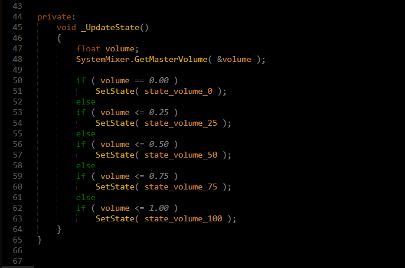

## MainThings is Color Scheme for Sublime Text 3

This is the Color Scheme for Sublime Text 3. 

A specially for D language.

( added: JSON, MarkDown, Bash, Python )

## Concept

- Highlight Important word
- Darken less important word
- Darkest other words

Importance priority:
1. Name of class, struct, interface, enum, function
2. function()
3. variable
4. constant
5. operator: + - * / =
6. keyword
7. declaration
8. other: brackets, comment, modifier

## Demo

## Installation

#### Via Package Control

[MainThings](https://packagecontrol.io/packages/MainThings) from Package Control.

#### Via git

`git clone` this repository and copy the MainThings file into your packages directory (User)

### Activating the Color Scheme

For activating, click on Preferences -> Color Scheme -> MainThings. 

#### See also

Good looks with [Cyanide - Wood Theme](https://packagecontrol.io/packages/Theme%20-%20Cyanide)

